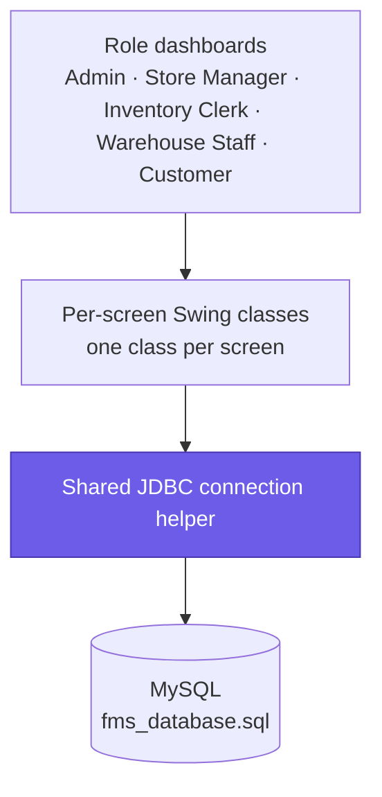

# Furniture Management System

A role-based desktop inventory and order management system for a furniture
business, built with Java Swing and a MySQL backend.

## Features

- Separate dashboards for Admin, Store Manager, Inventory Clerk, Warehouse
  Staff, and Customer roles
- Product, category, customer, and user management (CRUD)
- Order management and invoicing
- MySQL-backed persistent storage (schema in `fms_database.sql`)

## Architecture

## Stack

- **UI:** Java, Swing (NetBeans GUI builder)
- **Database:** MySQL, accessed directly via JDBC (`mysql-connector-j`)
- **Build:** NetBeans / Ant (`nbproject/`, `build.xml`)

Each screen is its own class that talks to the database directly through a
shared `JDBC` connection helper — a straightforward, one-class-per-screen
structure rather than a layered (UI/service/DAO) architecture.

## Running it

1. Open the project in NetBeans (standard NetBeans Ant project).
2. Import `fms_database.sql` into MySQL.
3. Set the `DB_USER` / `DB_PASSWORD` environment variables (read by `JDBC.java`
   — no credentials are hardcoded in source).
4. Build and run.

## Screenshots

Not yet added. Good candidates: the Admin dashboard, the product/order CRUD
screens, and one screen per role showing the role-gated navigation.

## Notes

Most queries use `PreparedStatement` with parameter placeholders; a few
read-only queries still build SQL by string concatenation and are on the
list to convert. Password checks are also a plaintext comparison for now —
both are known follow-ups rather than gaps I've missed.
